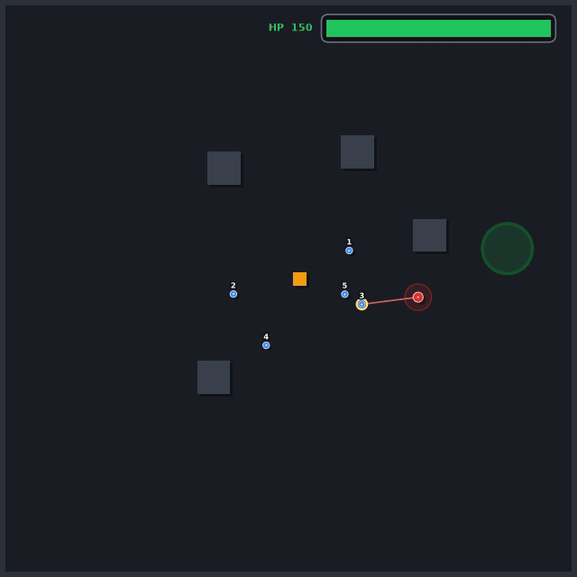
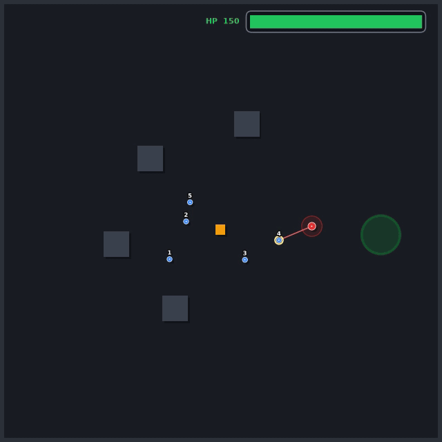

# Swarm Transport: Cooperative Delivery Under Pursuit

A custom vectorized multi-agent simulator in PyTorch. Five agents, trained with MAPPO, learn to haul a heavy crate to a goal and evade a scripted predator that guards it. Shared health; episodes end on delivery, capture, or timeout.

## Live Demo

**Trained policy** — production MAPPO checkpoint (`variant_c_400/seed_4/checkpoint_best.pt`). Best periodic eval **70.5% win / 14.1% capture** (iter 300). Final eval **67.4% win / 10.6% capture / 22.0% timeout**; mean win in 322 steps, end health ~82.



[MP4](outputs/actor_variant_c_400_seed_4_demo.mp4)

**Scripted policy** — hand-written approach → push → evade controller. Same 32-dim local observation as the actor. Solvability check and benchmark, not a learned policy.



[MP4](outputs/scripted_demo.mp4)

`python -m tools.evaluate` scores both policies on the same metrics. Control died about as often as it won; seed 4 cut capture by ~3× and learned who stands behind the crate.

| | Win | Capture |
|---|---:|---:|
| Control (shared progress, weak threat) | 37–41% | 34–47% |
| Trained (seed 4) | **67%** | **11%** |

- **Steering.** Push efficiency = `(F_agents→payload · goal_dir) / |F|`. Seed 4 eval **41%** — more of the contact points at the goal. Scripted is a fixed rule with no learned steering.
- **Collaboration.** Position ratio = agents on the push side (cos < −0.4, inside r=0.5) / agents blocking the front (cos > 0.4). Seed 4 eval **3.6** (starts near 1.0). Scripted has no role split beyond “nearest agent flees.”

## How It Works

### Task

5 agents, 1 predator, 1 non-rotating box payload, 4 AABB obstacles. 900 steps, dt=0.05. Arena inner faces at ±8.5. Goal at radius 6.3; success if the payload center is within 0.75. Shared health 150; flat drain of 10 per hit; 40-step predator cooldown at half speed.

### Rewards

| Term | Coef | Scope |
|---|---|---|
| Progress | +50 | 70% blamed on agents in `push_zone_radius=0.5` (split among them); 30% shared |
| Approach | +8 | Private. Delta to the standoff behind the payload. Never annealed |
| Push | +8 | Private. This agent's goalward contact penetration |
| Threat | −1.0 × intrusion² × closing | Private. Radius 2.5; zero when the predator is parked |
| Health | −1.0 | 70% flat private blame on agents in capture radius |
| Time | −0.10 / step | Shared |
| Success / capture | +450 / −250 | Shared terminal |
| Collision | −0.002 × force mag | Private |
| Camp / flee | 0 | Logged, unused |

Constraint chain (asserted by tests): clock 90 < full drain 150 < capture 250 < win 450.

### Physics

Semi-implicit Euler. Penalty (spring) forces, no rotation. Wall stiffness 1200, body 200, payload 250. Agent speed cap 20; predator 3.5 (1.75 on cooldown). Walls are half-thickness 1.5 / 3.0 thick (midline at 10.0) so a one-step rebound cannot tunnel a body past the outer face.

### Environment

Spawn is valid by construction: payload → agents (annulus 1.2–2.4) → predator (radius 3.6) → goal → 4 obstacles in a 6-sector polar ring (band 3.5–4.3). Predator scores `dist_to_self + 0.5 × dist_to_payload` and locks on for 20 steps.

### Observations

32-dim local vectors (positions / 8.5, velocities / 5.0, health / 150): own pos/vel, goal, payload, teammates, time remaining, predator, normalized health. No lidar, no cooldown bit, no obstacles. Actor is local-only. Critic is 165-dim (5×32 + one-hot agent id).

### Checkpoints

Every 25 iterations: `checkpoint_latest.pt`. Every 100: a numbered snapshot. Periodic eval (16 envs) writes `checkpoint_best.pt` on best win rate. `load_checkpoint` restores actor, critic, optimizers, and value-norm; `map_location` defaults to CPU. Resume with `trainer.load(...)`.

### Rendering

`tools/render.py` records the episode, then draws it (matplotlib + imageio). Dark arena, drop shadows, numbered agents, velocity ticks, predator lock-on and cooldown, push-zone tint, solid goal ring, health bar. Demo GIFs pick the 6 cleanest wins from 100 episodes. `python -m tools.render` also writes MP4s.

### Logging

Per-iteration JSON. Train and eval share the same helpers.

| Metric | How it is computed | What it measures |
|---|---|---|
| Win / capture / timeout | How the episode ended (goal, health=0, clock) | Outcome mix |
| Position ratio | `#behind / #front` in the 0.5 push zone | Side selection / collaboration |
| Push efficiency | `(F_agents→payload · goal_dir) / \|F\|` | Steering: how much contact is goalward |
| Payload progress | Start distance to goal minus end distance | How far the crate actually moved |
| Hunted evade cosine | Mean `cos(action, away)` for the lock-on target inside r=2.5 | Whether the hunted agent flees (+) or steers in (−) |
| Evade cosine | Same cosine for anyone in the danger radius | Team-wide evasion |
| Camping time | Fraction of env-steps with predator–payload dist < 0.75 | Predator sitting on the crate |
| Capture occupancy | Fraction of agent-steps inside capture radius 0.4 | Time spent in the damage bubble |
| Team spread | Mean distance from the team centroid | Clustering |
| `reward_*` | Per-term episode sums | Which term is driving the return |
| Policy / value loss, entropy, KL | PPO update stats | Training health |

### Tools

| Script | Role |
|---|---|
| `tools/evaluate.py` | Win/capture/timeout + the metrics above |
| `tools/calibrate.py` | Payload cruise speed → recommended `max_steps` |
| `tools/threat_probe.py` | Evasion cosine and pre-capture distance |
| `tools/threat_calibrate.py` | Size threat/camp coefs against the time penalty |
| `tools/freeze_probe.py` | Why agents freeze when the predator camps |
| `tools/train_seeds.py` | 7-seed production run |

### Design

Reasoning and rejected variants: [DESIGN.md](DESIGN.md).

Each term exists to buy a behavior, not to pad the return.

- **Get to the crate** → private approach (delta to the standoff behind the payload).
- **Stay on it and drive it** → private push (this agent's goalward contact) + progress blame (70% to whoever is in the zone).
- **Don't ignore the hunter, don't abandon the crate** → health blame + closing-gated threat. Threat is zero unless the gap is shrinking, so a predator sitting on the box does not tax the pushers.
- **Winning must beat dying, dying must beat waiting** → clock 90 < drain 150 < capture 250 < win 450.

Architecture and simulation:

- Custom batched tensors, no Gym. Actor is local (32-dim); critic is centralized (165-dim).
- Penalty forces, not impulses — the mechanic is sustained pushing, not bouncing.
- No rotation anywhere, so collision stays a tensor sum.
- Predator is a scripted guard with 20-step lock-on, not a learned adversary.

## Architecture

`Env.step`: predator → physics → health → reward → done → reset.

```
swarm-transport/
├── env/
│   ├── env.py            Env.step pipeline
│   ├── physics.py        Batched penalty-force integration
│   ├── scenario.py       Spawn, observe, rewards, predator, health
│   └── world.py          WorldState tensors
├── train/
│   ├── config.py         All constants
│   ├── mappo.py          Actor, Critic, MAPPOTrainer
│   └── checkpoints.py    Save / load
├── tools/
│   ├── train_seeds.py    7 × 400 production run
│   ├── evaluate.py       Scripted vs trained eval
│   ├── render.py         Demo MP4s
│   ├── render_seeds.py   Per-seed GIFs
│   ├── scripted_policy.py
│   ├── calibrate.py
│   ├── threat_probe.py
│   ├── threat_calibrate.py
│   ├── freeze_probe.py
│   └── static_reward_probe.py
├── tests/                Physics, env, reward invariants, GAE
├── outputs/              Demo MP4s and training JSON
└── requirements.txt
```

## Tech Stack

Python, PyTorch 2.2, custom MAPPO (shared actor, centralized critic, GAE, value norm). Vectorized batched envs (128). pytest, matplotlib, imageio. No Gym / PettingZoo.

Training: γ=0.999, 128 envs × 128 steps × 5 agents = 81,920 samples/iter, minibatch 4096, 10 epochs, hidden 128, 400 iterations.

## Getting Started

```bash
python -m venv .venv && source .venv/bin/activate
pip install -r requirements.txt
pytest tests/ -q

python -m train.mappo              # one seed, 400 iter; Config.device = "cpu" or "cuda"
python -m tools.train_seeds        # 7 seeds → outputs/variant_c_400.json
python -m tools.evaluate           # scripted vs each seed's best
python -m tools.render             # demo MP4s
```

Preview a run without changing the LR schedule: `MAPPOTrainer(config).train(max_iterations=30)` — annealing still uses the full 400. Resume: `trainer.load("train/checkpoints/checkpoint_latest.pt")`.

Diagnostics: `python -m tools.calibrate`, `python -m tools.threat_probe`, `python -m tools.threat_calibrate`, `python -m tools.freeze_probe`.

## Challenges and Takeaways

Reward design was the hard problem. The rest of the work was making that signal honest and measurable.

- **Collision / clipping.** Penalty forces plus thin walls let contact launch agents out of the arena. Thick walls (midline at 10.0) and a speed cap of 20 keep bodies inside.
- **Predator lock-on.** Early targeting re-picked every step, so fleeing just handed the hunter a new victim. A 20-step commit made evasion a real behavior.
- **Unnormalized health.** Raw 0–150 in the observation flipped agents between flee and suicide. Dividing by `max_health` fixed it.
- **Approach and push.** Agents would not learn to get behind the crate or stay on it. Approach + push (+8 each) taught both. Approach was first annealed; constant approach won (12.5% → ~67% on the production seed).
- **Push vs flee.** Paying for progress made agents farm approach and freeze when the predator sat on the crate. Closing-gated threat (intrusion² × closing, r=2.5) penalizes a hunter coming straight at you without taxing a parked predator.
- **Blame / masking.** Shared progress and shared health gave every agent the same number, so nobody learned side selection or evasion. Private shares (70%) fixed both.
- **Tuning.** Every coefficient has a constraint: clock < drain < capture < win; threat sized against the time penalty, not progress RMS. Tests assert the inequalities.
- **Scripted as a benchmark.** Comparing against the hand-written controller — and against simulated evasion — was enough. Behavioral cloning was not needed.
- **Logging.** The metric set grew with the bugs: outcome split, per-term rewards, position ratio, push efficiency, hunted cosine, camping time. Render for eyes; JSON for structure.
- **Seeds and checkpoints.** Production across 7 seeds is **40–67% win** (mean ~53%). Multi-seed eval is how a lucky run is distinguished from a recipe. Preview iterations (`max_iterations=30`) check a long run early. `checkpoint_best.pt` plus reload reused the best board instead of the last one.
- **Device.** Most training ran on a local CPU. `Config.device` is the only switch — env, physics, and MAPPO follow it on CPU or GPU.
